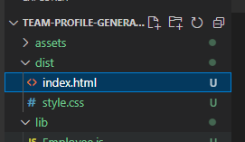

# **Team Profile Generator**

## **Description**

This project will let you create a cleanly formatted team roster based on your user input. You add a Manager, and then any number of Engineers and Interns. Once you're finished filling out the prompts the program will generate an HTML page to the "dist" folder with your generated page. There's also CSS to go along with it.

---

## **Table of Contents**

* [Installation](#installation)

* [Usage](#usage)

* [Screenshots](#screenshots)

* [Video Tutorial](#video)

* [License](#license)

* [Contributing](#contributing)

* [Tests](#tests)

* [Questions](#questions)

---

## **Installation**

To install the needed dependencies, run the following commands:

```
npm i 
```

---

## **Usage**

To run the program, run the following commands once the needed dependencies have been installed:

```
npm start
```

---

## **Screenshots & Video**

First Install the Dependencies
\

\
\
Then start the program and follow the prompts. Once you finish the manager section you will be prompted to add more employees. Make your choice with the arrow keys.
\

\
\
Once you've added all the employees you want, choose the "I'm Done!" option.
\

\
\
Once finished you should see a message stating the HTML page was generated.
\

\
\
View your newly generated HTML page in the dist folder
\

\
Viewing your HTML page in a browser should look like the following: 
\

\

---

## **Video Tutorial**
A video on how to install and run this program can be viewed by clicking the screenshot below: 
[](https://drive.google.com/file/d/1cpYWgFdUt3BhgN_8-TayVFXD8VZmGch7/view)

Or clicking this link: [https://drive.google.com/file/d/1XrrypB45H4V_qKwFgxUY0eWpuM3CBrkD/view](https://drive.google.com/file/d/1XrrypB45H4V_qKwFgxUY0eWpuM3CBrkD/view)

---

## **License**

This project is using no license.

---

## **Contributing**

This project is open source so you can contribute to it by submitting issues to the repo or by forking it and tweaking it to your own liking. 

---

## **Tests**

To test the project, run the following commands:

```
npm test
```

---

## **Questions**

If you have any questions about the project or repo, contact me directly at justincodingclass@gmail.com or open an issue on the repo. You can find my github profile with this project and others at [github.com/jwatkins28](https://github.com/jwatkins28/)
